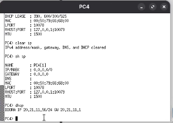
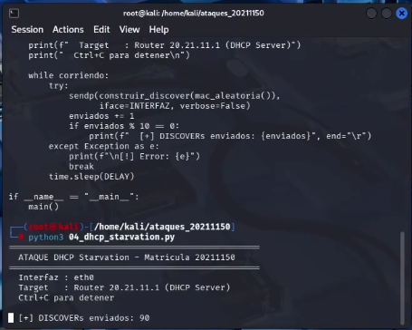
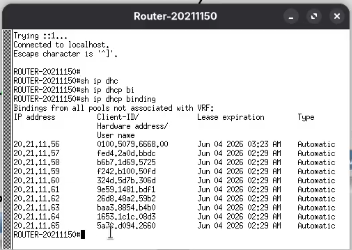
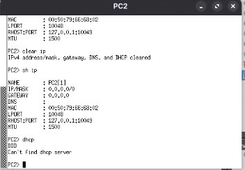
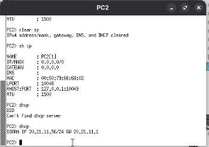

# DHCP-Starvation-20211150
# Ataque DHCP Starvation — Matrícula 20211150
**Autor:** Alvaro Smilk Baez Tavera
**Matrícula:** 20211150
**Fecha:** 3 Junio 2026

---

## Descripción
Script que agota el pool de direcciones IP del servidor 
DHCP legítimo enviando masivamente peticiones DHCP 
DISCOVER con MACs falsas aleatorias, impidiendo que 
los hosts legítimos obtengan configuración de red.

---

## Objetivo
Demostrar el ataque de agotamiento del pool DHCP sobre 
un router Cisco, causando denegación de servicio de red 
a los hosts legítimos y aplicando las contramedidas.

---

## Topología
Router-20211150 (20.21.11.1) ← DHCP Server
|
SW1-20211150 (20.21.11.2)
/        
Kali Linux    PC1/PC2/PC3
(20.21.11.50) (Víctimas)
ATACANTE

## Direccionamiento
| Dispositivo | IP          | Interfaz | Rol           |
|-------------|-------------|----------|---------------|
| Router      | 20.21.11.1  | gi0/0    | DHCP Server   |
| SW1         | 20.21.11.2  | gi0/0    | Switch        |
| Kali Linux  | 20.21.11.50 | gi3/3    | Atacante      |
| PC1         | DHCP        | gi0/1    | Víctima       |
| PC2         | DHCP        | gi0/2    | Víctima       |
| PC3         | DHCP        | gi0/3    | Víctima       |

## Pool DHCP del laboratorio
| Pool          | Rango                         | IPs |
|---------------|-------------------------------|-----|
| LAB-20211150  | 20.21.11.56 – 20.21.11.65    | 10  |

---

## Requisitos
- Python 3
- Scapy instalado
- Privilegios root
- DHCP Snooping desactivado en el switch

### Instalación
```bash
pip3 install scapy --break-system-packages
```

---

## Parámetros del script
| Parámetro | Valor  | Descripción                     |
|-----------|--------|---------------------------------|
| INTERFAZ  | eth0   | Interfaz del atacante           |
| DELAY     | 0.0001 | Segundos entre paquetes         |
| MAX_PKTS  | 0      | 0 = infinito                    |
| DST       | 255.255.255.255 | Broadcast DHCP         |

---

## Uso
```bash
# Básico:
sudo python3 04_dhcp_starvation.py

# Especificar interfaz:
sudo python3 04_dhcp_starvation.py eth0

# Limitar paquetes:
sudo python3 04_dhcp_starvation.py eth0 500
```

---

## Funcionamiento
1. Genera MAC aleatoria única por iteración
2. Construye DHCP DISCOVER con esa MAC falsa
3. Envía al broadcast 255.255.255.255 puerto 67
4. El router asigna una IP a cada MAC diferente
5. Con 10 IPs disponibles el pool se agota rápido
6. Los hosts legítimos no pueden obtener IP

---

## Verificación del ataque
```bash
# En el router — pool agotándose:
show ip dhcp pool
# Leased addresses: 10
# Available: 0

# Ver MACs falsas asignadas:
show ip dhcp binding

# En PC víctima:
dhcp
# Can't find dhcp server ← DoS exitoso
```

---

## Capturas
### Antes — pool disponible


### Script corriendo en Kali


### Pool agotado en el router


### PC víctima sin IP


---

## Contramedida
```bash
SW1(config)# ip dhcp snooping
SW1(config)# ip dhcp snooping vlan 1
SW1(config)# no ip dhcp snooping information option
SW1(config)# interface gi0/0
SW1(config-if)# ip dhcp snooping trust
SW1(config-if)# exit
SW1(config)# interface range gi0/1-3
SW1(config-if)# ip dhcp snooping limit rate 10
SW1(config-if)# exit
SW1(config)# interface gi3/3
SW1(config-if)# ip dhcp snooping limit rate 10
SW1(config-if)# exit
SW1(config)# end
SW1# write memory

# Limpiar bindings falsos:
Router# clear ip dhcp binding *

# Verificar:
SW1# show ip dhcp snooping statistics
# Packets Dropped: X ← Starvation bloqueado
```

### Verificación contramedida


---

## Video
[Ver demostración en YouTube](https://youtu.be/9vnlS67g13Q?si=B5IcYjxQqIiZrDbv)

---

## Referencias
- RFC 2131: DHCP Protocol
- Cisco DHCP Snooping Configuration Guide
- Herramienta: Python 3 + Scapy
